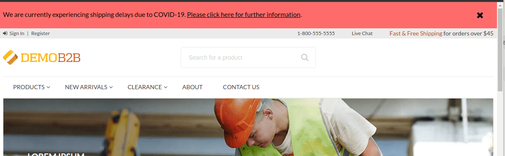
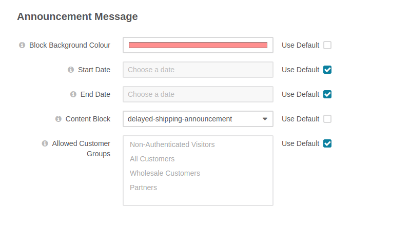

Aligent OroCommerce Announcement Bundle
==============================
This bundle adds the ability to display a custom Announcement Message on the OroCommerce storefront.



### Example Use Cases
- Shipping Delays
- Public Holiday closures
- Promotional Messages
- Upcoming Website Maintenance

### Features
- Select custom Background Colour for Announcement
- Set optional Start/End Date for Announcement
- Restrict Announcement to one or more Customer Groups 

Requirements
-------------------
- OroCommerce 5.0

Installation and Usage
-------------------
**NOTE: Adjust instructions as needed for your local environment**

### Installation
Install via Composer
```shell
composer require aligent/orocommerce-announcement-bundle
```

Once installed, run platform update to perform the installation:
```shell
php bin/console oro:platform:update --env=prod
```


### Configuration Settings



| Setting                     | Description                                                                                                                |
|-----------------------------|----------------------------------------------------------------------------------------------------------------------------|
| **Block Background Colour** | Select the background colour for the Announcement on the storefront (Colour picker)                                        |
| **Start Date**              | Date to start displaying the Announcement (Use Default for 'immediately')                                                  |
| **End Date**                | Date to stop displaying the Announcement (Use Default for 'forever')                                                       |
| **Content Block**           | Select the Content Block containing the message to display                                                                 |
| **Allowed Customer Groups** | If enabled, only these Customer Groups will see the announcement message. (NOTE: **Ctrl+Click** to select multiple Groups) |

Database Modifications
-------------------
*This Bundle does not directly modify the database schema in any way*

All configuration is stored in System Configuration (`oro_config_value`).

Templates
-------------------
`Resources/views/layouts/default/page/alert_bar.html.twig`

This includes a single `_alert_bar_widget` block which can be customized/overridden in OroCommerce themes
if needed.

Roadmap / Remaining Tasks
-------------------
- [x] Ability to restrict Announcement to one or more Customer Groups
- [x] OroCommerce 5.0 Support
- [x] Implement Unit Tests
- [x] Refactor `AnnouncementDataProvider`
- [ ] Consistent naming of `color` (deprecate `colour`)
- [ ] Reset `hideAlert` session variable when new Announcements are added
- [ ] Ability to block dismissal of Announcement Message (hides the 'X' button)
- [ ] Ability to only display on Homepage
- [ ] Ability to configure multiple messages for different scenarios
- [ ] (TBC) Move away from Content Blocks to WYSIWYG configuration fields
